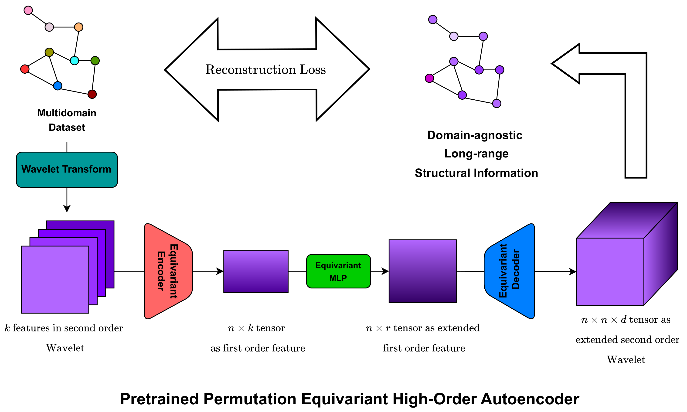

# Range-aware Graph Positional Encoding via High-order Pretraining: Theory and Practice



## Publication

* Accepted at Machine Learning: Science and Technology journal (IOP Publishing, Q1, Impact Factor = 4.6): https://iopscience.iop.org/article/10.1088/2632-2153/ae1acd

* NeurIPS 2024 Workshop NeurReps: https://openreview.net/forum?id=tN0n5BuLEI

* Preprint: https://arxiv.org/abs/2409.19117

## Overview
This repository contains the implementation of **HOPE-WavePE (High-Order Permutation-Equivariant Autoencoder for Wavelet Positional Encoding)**, a novel graph representation learning method. HOPE-WavePE extends **Wavelet Positional Encoding (WavePE)** by utilizing a multi-resolution **autoencoder** to capture both local and global structures in graphs.

This project is designed for **unsupervised pretraining on graph datasets**, making it adaptable for a wide range of **graph-based machine learning tasks**, including:
- Molecular property prediction
- Materials discovery
- Social network analysis
- Bioinformatics

## Features
- **Graph-agnostic pretraining**: Learns structural representations independent of node/edge features.
- **Wavelet-based encoding**: Captures multi-resolution graph structures.
- **High-order autoencoder**: Preserves long-range dependencies in graphs.
- **Flexible training pipeline**: Supports multiple datasets (e.g., MoleculeNet, TU Dataset, ZINC, LRGB).
- **Supports Graph Transformers & MPNNs**: Integrates with GNNs for downstream tasks.

## Installation
Ensure you have Python 3.8+ installed.

1. Clone this repository:
   ```bash
   git clone https://github.com/HySonLab/WaveletPE.git
   cd WaveletPE
   ```

2. Create a virtual environment (optional but recommended):
   ```bash
   python -m venv venv
   source venv/bin/activate  # On Windows, use: venv\Scripts\activate
   ```

3. Install dependencies:
   ```bash
   pip install -r requirements.txt
   ```

## Usage
### 1. Pretraining the HOPE-WavePE Autoencoder
Pretrain the autoencoder on a dataset (e.g., MolPCBA) with:
```bash
python train.py --dataset molpcba --epochs 100
```

### 2. Fine-tuning on a Downstream Task
After pretraining, you can fine-tune the model on a specific graph-based task. For example, to train on **ZINC molecular dataset**:
```bash
python train_zinc.py --pretrained_model checkpoints/hope_wavepe.pth
```

### 3. Running Inference
To run inference using a pretrained model:
```bash
python example.py --model checkpoints/hope_wavepe.pth --input data/sample_graph.json
```

### 4. Evaluating the Model
Evaluate the pretrained model on a benchmark dataset (e.g., TU Dataset, LRGB):
```bash
python downstream.py --dataset tu-proteins --model checkpoints/hope_wavepe.pth
```

## Directory Structure
```
wavepe-master/
│── encoder/              # Implementation of HOPE-WavePE autoencoder
│── layer/                # Graph layers and model components
│── net/                  # Neural network model definitions
│── data.py               # Graph data processing
│── train.py              # Training script for pretraining
│── train_zinc.py         # Training script for ZINC dataset
│── downstream.py         # Fine-tuning on downstream tasks
│── transform.py          # Graph transformations and preprocessing
│── utils/                # Helper functions
│── logs/                 # Training logs
│── checkpoints/          # Model checkpoints
│── example.py            # Running inference
│── config/               # Configuration files
│── scripts/              # Additional scripts for automation
│── requirements.txt      # Dependencies
│── README.md             # This documentation
```

## Citation
If you use this work in your research, please cite the corresponding papers:

```bibtex
@article{Anh Nguyen_2025,
doi = {10.1088/2632-2153/ae1acd},
url = {https://doi.org/10.1088/2632-2153/ae1acd},
year = {2025},
month = {nov},
publisher = {IOP Publishing},
volume = {6},
number = {4},
pages = {045043},
author = {Anh Nguyen, Viet and Khang Ngo, Nhat and Hy, Truong-Son},
title = {Range-aware graph positional encoding via high-order pretraining: theory and practice},
journal = {Machine Learning: Science and Technology},
abstract = {Unsupervised pre-training on vast amounts of graph data is critical in real-world applications wherein labeled data is limited, such as molecule properties prediction or materials science. Existing approaches pre-train models for specific graph domains, neglecting the inherent connections within networks. This limits their ability to transfer knowledge to various supervised tasks. In this work, we propose a novel pre-training strategy on graphs that focuses on modeling their multi-resolution structural information, allowing us to capture global information of the whole graph while preserving local structures around its nodes. We extend the work of Graph Wavelet Positional Encoding (WavePE) from Ngo et al (2023 J. Chem. Phys. 159 034109) by pretraining a High-Order Permutation-Equivariant Autoencoder (HOPE-WavePE) to reconstruct node connectivities from their multi-resolution wavelet signals. Since our approach relies solely on the graph structure, it is domain-agnostic and adaptable to datasets from various domains, therefore paving the way for developing general graph structure encoders and graph foundation models. We theoretically demonstrate that for k given resolutions, the width required for the autoencoder to learn arbitrarily long-range information is  where  denote the number of nodes and the rank of normalized Laplacian, respectively, and ε is the error tolerance defined by the Frobenius norm. We also evaluate HOPE-WavePE on graph-level prediction tasks of different areas and show its superiority compared to other methods. Our source code is publicly available at https://github.com/HySonLab/WaveletPE.}
}
```

```bibtex
@inproceedings{
nguyen2025rangeaware,
title={Range-aware Positional Encoding via High-order Pretraining: Theory and Practice},
author={Viet Anh Nguyen and Nhat Khang Ngo and Hy Truong Son},
booktitle={NeurIPS 2024 Workshop on Symmetry and Geometry in Neural Representations},
year={2025},
url={https://openreview.net/forum?id=tN0n5BuLEI}
}
```

## Contact
For questions or issues, please reach out to **Truong-Son Hy** at [thy@uab.edu](mailto:thy@uab.edu).


